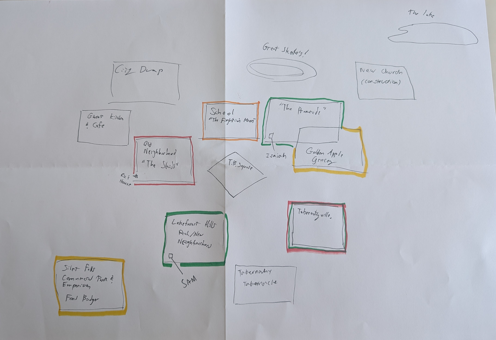

tags:: kids-on-bikes, sessions, [[The Disappearance of Zeke Kamiski]]

- ## We Start looking at a town
  We started with town creation. Sketching the picture of [[Silent Falls, USA]]
	- ### What did it used to be?
	  We used to be a coal-mining town. One of many that served as the lifeblood of the American steel industry. The mines dried up in the 1950s, and were closed off to the public due to safety concerns.
	- ### What is it becoming?
	- These days, the town’s home to a few regional offices of small American companies but we don’t have any particular productive industry anymore. It’s a quiet, small town, but most people here like it like that.
	- ### What keeps us separated from the outside world?
	  Silent falls is irrelevant. After the mining industry closed up, we didn't have anything to offer the world outside.
	- ### What keeps  connected with the outside world?
	  We host an [[Annual Fishing & Washer Festival]], at [[Lake Clearwater]]. It is what people in nearby towns think of first when they think of Silent Falls.
	- ### Who founded our town? And how do we choose to remember him?
	  It was founded by [[James P. Tabernathy]], and most things in the town are named after him. (Think like the Carnaegies in Pittsburgh). The town thinks of him largely uncritically as a wealthy and benefactor and industrialist.
	- ### Why was it founded here?
	  The town was originally just a small settlement in a mountain valley, but it blew up after the discovery of a rich coal vein in in the mountain, and the opening of the [[Silent Falls Coal Mine]]
	- ### What important figure from the town's history has been forgotten?
	  [[Susan Tabernathy]], the wife of James, has largely been forgotten by the locals of the town. However, she was the one who was responsible for the cutthroat business practices and massive success of both the [[Tabernathy Mining Group]] and the [[Tabernathy Washer & Fastener Company]].
	  
	  While everything in the town is named after her husband, she has a single bench in [[Tabernathy Square]] with her name on a plaque, next to a giant statue of a washer, and a smaller statue of her husband.
	- ### What iconic place do the townspeople identify with?
	  [[Tabernathy Square]] is the central hub of the town, where town hall is constructed. [[First Friday]] happens here every month. The square is dominated by [[The World's (2nd) Largest Washer]], and a large statue of James P Tabernathy
	- ### What forbidden place do we view with suspicion?
	  The [[Silent Falls Coal Mine]]. It's been barricaded and abandoned.
	- ### How do the people here affirm their identities?
	  By Tithing to the lcoal church, [[The Tabernacle]].
- ## Our Figure
  After creating a town, we entered the cold open for the story [[The Disappearance of Zeke Kamiski]], by creating our figure.
	- We start with a figure. [[Zeke Kamiski]], a 17 year old boy, behind the local discount grocery store [[Food Badger]].
	- ### What does he wish he had? What does he have that he doesn't recognize?
	  He wishes he had the confidence to move away from  Silent Falls. And he dosn't recognize how much the love and support he gets from his family is really worth.
	- ### What does he actually lack? Why can't he see that he lacks it?
	  He actually lacks support from his family to move out of town. They're supportive, but Zeke has a bit of a codependent relationship with his family.
	  His father [[David Kamiski]] runs the local hardware store, and is expecting Zeke to take over it after he grows up. He's been taking shifts there since he was a kid, and has een wearing the same "Assistant Manager" since he was a baby, when his mom made it as a joke for a family photo.
	- ### What face does he present to the town? What face does he reserve for his closest friends and family?
	  Zeke tries to come off as a "Bad Kid". He hangs with the [[Town Goths]], wears all black, and smokes clove cigarettes. But, the reality is that he has a hidden sensitive side. He steals his younger sister [[Sam Kaminski]]'s children's books because he prefers books with friends that work together. Sometimes he shoplifts nail polish in colours other than black, but he can't let the other goths know that.
	- ### How is he alone in this moment? Why is he not alone in general?
	  In this moment, he is out running an errand. Sam, his little sister, had a craving for Stelladora Breakfast Treats. So Zeke went on a trip around the block to pick them up. In general, he is not alone because he has his tomboy sister as a confidant.
- ## The Cold Open
  We see Zeke in the employee parking lot behind the [local strip mall]([[Silent Falls Commercial Park and Emporium]]). It's an unseasonably warm autumn night, and he's taking a moment to pause and contemplate. He's just turned 17, and he's going into his senior year of highschool. The question of what he's going to do with the rest of his life is looming large in his mind.
  He needs to clear his thoughts. We watch him pull a crinkled plastic baggie out of his back pocket, and roll a skinny, crooked clove cigarette. It's barely holding together.
  Just as he moves to light it, we hear from out of frame, a phone ringing.
  Zeke looks over his shoulder at a payphone. Was that always there?
  Curious, he goes over to answer it.
  he raises the receiver to his ear, and disappears.
  The last thing we see is the receiver hanging from the cord.
- ## Town Creation
  After tossing the dice, we created this outline for the town
	- 
	- [[Lake Clearwater]], where the [[Annual Fishing & Washer Festival]] happens
	- [[The Promenade]], a fancy new development in Downtown Silent Hills.
	- [[Great Skates]] , the skating rink near The Promenade.
		- It was later established that the [[Town Goths]] host their "midnight mass" here, [[The Conclave at Great Skates]].
	- [[Tabernathy Technical Highschool]], The only highschool in town. Their mascot is [[The Fightin' Miners]]
	- [[Tabernathy Square]]
	- [[Taberville]], the old rich neighbourhood. The tabernathies live here.
	- [[Lakeforest Hills]], a new neighbourhood built by bulldozing the old woods.
	- [[The Skids]], a neighbourhood of mostly apartment buildings made in a hurry for the mine workers and their families.
	- [[Gwen's Kitchen & Cafe]], a greasy diner near the skids
	- [[The City Dump]]
	- [[Silent Falls Commercial Park and Emporium]], host to [[Food Badger]], [[The Fantasy Store]]
- ## Character Creation
  Next, we created our player characters and some relationships between them
	- [[Rick "Monstrosity" Münster]], The youngest goth in town (14)
		- Rick knows zeke through the goth community. He used to buy cigarettes off Zeke
		- Rick knows of Isaiah because a respected member of the church, [[America Elizabeth]] speaks highly of him after Isaiah helped her cross the street once
	- [[Isaiah Madison]], The pastor's son (15)
		- Isaiah knows Zeke because he was the only upperclassman who was nice to him in their shared calculus class
		- Isaiah knows Sam through *(I don't remember)*
	- [[Sam Kamiski]], Zeke's tomboyish younger sister (13)
		- Sam knows Rick because they ran in the same circles, through Zeke. Sam was the lookout when Rick stole his bike.
		- Sam ratted out Rick somewhere *(I don't remember at time of writing)*
- ## Gameplay
	- It's been a week since Zeke disappeared. The police haven't turned up much, and Zeke's father [[David Kamiski]] has started coordinating a community search with the [[Miner's Underground]].
	- Sam thinks no one is trying hard enough, and no one is taking the right angle. She's gathered together whoever she could convince to help her into their own search party.
	- We open on The Kamiski family basement, where Sam, Isaiah, and Rick are brainstorming on avenues to explore to try to track down Zeke
		- Sam knows he was last seen on the way to the Food Badger to pick up Stelladora Breakfast Treats for her. She feels guilty about this
		- *(?) can't remember other avenues discussed here*
	- The group bikes over to the [[Food Badger]] to try to view the old security tapes. With some work, they're able to convince the owner of the Food Badger, [[Mr. Bashir]] to let them view the security footage.
	- Mr. Bashir mentions that the police have been by and already looked at the tapes
	- All they get from the tape is that Zeke walked behind the strip mall. Food Badger doesn't have rear CCTV covering the parking lot.
	- The group goes next door to [[The Fantasy Store]], which is run by [[Raven Darkwing]], the girlfriend of [[Loki Moonshadow (Tony Calveresi)]]
	- With some negotiation,